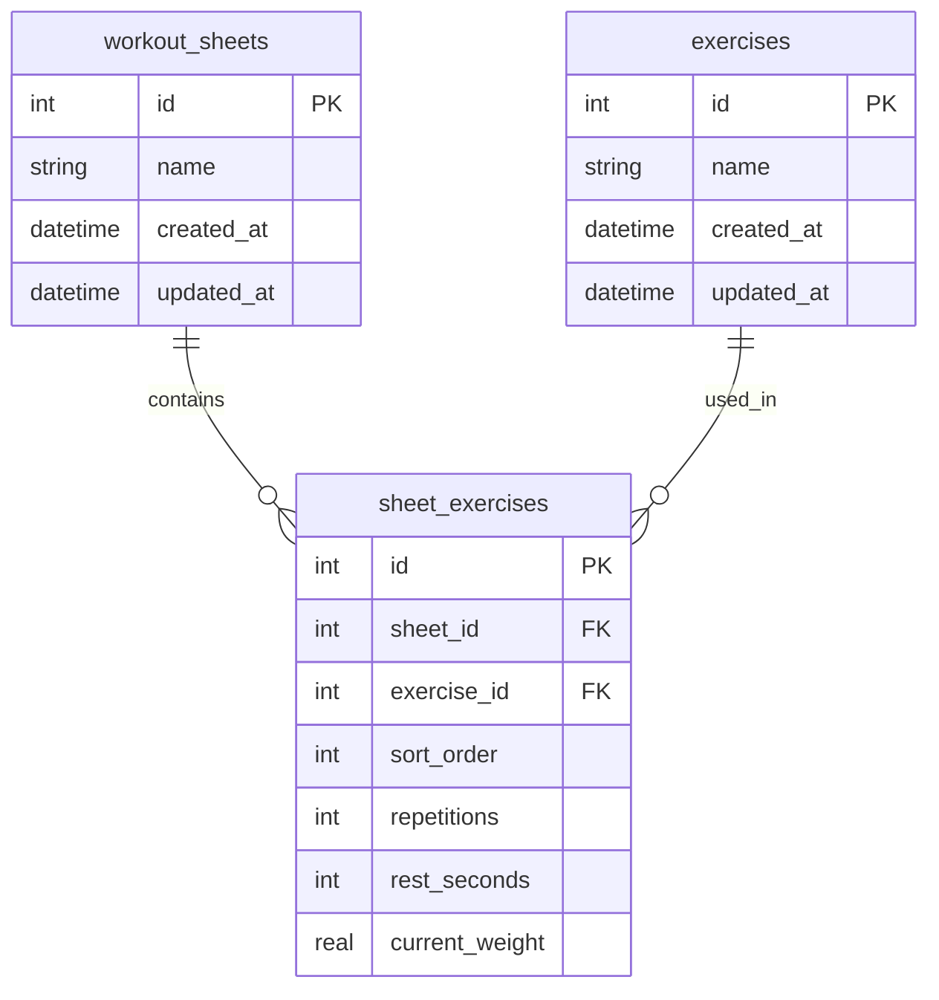
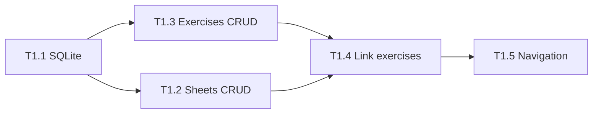

# Feature 1: Workout Sheet Creation

> English implementation plan derived from `1-Criação de Fichas de Treino.md`, reviewed against `SPEC.md` and the current `nerd-gym` codebase (Expo SDK 56, greenfield — no persistence layer yet).

**Priority:** High  
**Depends on:** Nothing (foundation feature)  
**Blocks:** Feature 2 (Offline Persistence), Feature 3 (Guided Workout), Feature 5 (Exercise Progress)

---

## Plan Review Summary

### What the original plan gets right

- Clear user stories covering CRUD for sheets and exercises
- Correct relational model direction (`workout_sheets` ↔ `sheet_exercises` ↔ `exercises`)
- Junction table preserves exercise reuse across sheets (CA1.3)
- Delete sheet without deleting exercises (CA1.5)
- BDD scenarios cover happy paths, validation, and reuse
- Exercise ordering within a sheet (T1.4)
- Performance target (< 100 ms with ~50 sheets)

### Gaps and conflicts found

| Topic | Original plan | `SPEC.md` / product | Recommendation |
|-------|---------------|---------------------|----------------|
| **Exercise parameters** | Stored on `exercises` (global); edits propagate to all sheets (CA1.4) | Reps, weight, rest configured when adding exercise **to a sheet** | **Decision required** — see Open Questions |
| **Categories** | Not in schema | Predefined: Costa, Braço, Inferior, Peito, Abdômen | Include in MVP if confirmed |
| **Weight field** | Not in exercise form | `current weight` per exercise in sheet | Defer to Feature 3 unless needed now |
| **Sheet name uniqueness** | CA1.1 requires unique names (min 3 chars) | Not explicitly stated | Enforce uniqueness if confirmed |
| **Duplicate exercise in sheet** | CA1.6 mentions validation | Not in BDD | Add validation on junction table |
| **SQLite setup** | T1.1 in Feature 1 | Feature 2 also covers offline | Keep setup in Feature 1; Feature 2 validates offline behavior |
| **UI / navigation** | Not specified | Tab-based app expected | Replace Expo template tabs with workout flows |

### Current codebase state

- App is still the Expo starter (Home / Explore tabs)
- No `expo-sqlite`, ORM, or repository layer installed
- NativeWind v5 + Expo Router already configured
- TypeScript strict mode, path aliases (`@/*`) ready

---

## User Stories

| ID | Story |
|----|-------|
| US-01 | As a user, I want to create a custom workout sheet so I can organize my training |
| US-02 | As a user, I want to add exercises to my workout sheet |
| US-03 | As a user, I want to set parameters for each exercise (repetitions, rest time, current weight) |
| US-04 | As a user, I want to view all my workout sheets |

---

## Locked Decisions

| Question | Decision | Implication |
|----------|----------|-------------|
| **Q1 — Exercise params** | **B — Per sheet** | `repetitions`, `rest_seconds`, and `current_weight` live on `sheet_exercises` |
| **Q2 — Categories** | **Not in Feature 1** | No `category` field; deferred to a later feature |
| **Q3 — Current weight** | **Yes, include now** | `current_weight` (kg) stored per exercise-in-sheet |
| **Q4 — Sheet names** | **Duplicates allowed** | No unique constraint on `name`; each sheet identified by auto-increment `id` |

---

## Final Data Model



**Indexes**

- `workout_sheets(id)` — primary lookup (PK)
- `exercises(name)` — search/filter
- `sheet_exercises(sheet_id, sort_order)` — ordered list
- `UNIQUE(sheet_id, exercise_id)` — prevent duplicate exercise in same sheet

**Identity rules**

- Sheets are uniquely identified by `id` (auto-increment integer PK)
- Duplicate sheet names are allowed (e.g. two sheets both named "Leg Day")
- List UI should show `id` or creation date as a disambiguator when names collide

---

## Architecture

```
src/
├── db/
│   ├── client.ts              # expo-sqlite open + migrations runner
│   ├── migrations/
│   │   └── 001_initial.sql
│   └── schema.ts              # TypeScript types mirroring tables
├── repositories/
│   ├── workout-sheet.repository.ts
│   ├── exercise.repository.ts
│   └── sheet-exercise.repository.ts
├── hooks/
│   ├── use-workout-sheets.ts
│   ├── use-exercises.ts
│   └── use-sheet-form.ts
├── components/
│   └── workout-sheets/        # list items, form fields, exercise picker
└── app/
    ├── (tabs)/
    │   ├── index.tsx          # redirect or sheets list
    │   └── sheets/
    │       ├── index.tsx      # sheet list
    │       ├── new.tsx        # create sheet
    │       └── [id]/
    │           ├── index.tsx  # sheet detail
    │           └── edit.tsx   # edit sheet
    └── exercises/
        ├── index.tsx          # exercise library + search
        └── new.tsx            # create exercise
```

**Patterns**

- Repository layer wraps all SQL — no raw queries in components
- Hooks expose async CRUD + loading/error state to screens
- Migrations run once on app boot via root layout provider
- Use `@/tw` primitives for all UI (NativeWind v5)

---

## Technical Tasks

### T1.1 — SQLite foundation

**Scope**

- Install `expo-sqlite` (Expo SDK 56 compatible)
- Create migration `001_initial.sql` with tables above
- Implement `db/client.ts` with init + version tracking
- Add repository interfaces for sheets, exercises, junction rows
- Wire DB init in `app/_layout.tsx` (blocking splash until ready)

---

### T1.2 — Workout sheet CRUD

**Scope**

- **List screen** (`sheets/index.tsx`): all sheets, empty state, tap to open, swipe-to-delete with confirm dialog
- **Create/Edit form**: sheet name field, embedded exercise list, save/cancel
- **Validations**
  - Name required, min 3 characters
  - Duplicate names allowed (sheets distinguished by `id`)
  - At least 1 exercise to save
- **List UI**: when multiple sheets share a name, show secondary label (e.g. `#3 · Jan 10` or exercise count)
- **Delete**: remove sheet + junction rows only; exercises remain

---

### T1.3 — Exercise CRUD + search

**Scope**

- **Exercise library screen**: list all exercises, search by name (case-insensitive)
- **Create/Edit form**: name only (params are set when adding to a sheet)
- Exercises persist independently of sheets
- Filter/search returns partial matches ("Supino" → "Supino Reto", "Supino Inclinado")

---

### T1.4 — Link exercises to sheets

**Scope**

- **Add exercise flow** inside sheet form:
  - Pick from existing library (search modal)
  - Or create inline new exercise
  - Set reps, rest, and current weight for this sheet
- **Reorder** exercises (drag handle or up/down buttons — prefer buttons for MVP simplicity)
- **Remove** exercise from sheet (junction delete only)
- Block adding same exercise twice to one sheet

---

### T1.5 — Navigation and tab shell

**Scope**

- Replace starter Home/Explore tabs with app structure, e.g.:
  - **Sheets** (primary tab)
  - **Exercises** (library tab)
  - Placeholder tabs for Progress / Workout (future features)
- Update icons and labels

---

## BDD Scenarios (English)

```gherkin
Feature: Manage Workout Sheets
  As a user
  I want to create and customize workout sheets
  So that I can organize my exercises

  Scenario: Create a new sheet with exercises
    Given I am on the sheet list screen
    When I tap "New Sheet"
    And I enter the name "Back Workout"
    And I add "Lat Pulldown" with 3 reps, 60s rest, and 40kg weight
    And I add "Barbell Row" with 4 reps, 90s rest, and 60kg weight
    And I tap "Save"
    Then I should see "Back Workout" in the list
    And opening it should show 2 exercises

  Scenario: Edit an existing sheet
    Given I have a sheet named "Back Workout"
    When I rename it to "Back and Biceps"
    And I add "Barbell Curl"
    And I save
    Then the name should be updated
    And the sheet should contain 3 exercises

  Scenario: Delete a sheet
    Given I have a sheet named "Test Sheet"
    When I swipe to delete and confirm
    Then the sheet should not appear in the list
    And junction records should be removed
    But exercises remain in the library

  Scenario: Save sheet without a name
    Given I am creating a new sheet
    When I leave the name empty and tap "Save"
    Then I should see "Sheet name is required"
    And the sheet should not be saved

  Scenario: Reuse an exercise across sheets
    Given "Bench Press" exists in the library
    When I add it to "Chest Day"
    And I also add it to "Full Body"
    Then both sheets should show the exercise

  Scenario: Duplicate sheet names allowed
    Given I have a sheet named "Leg Day" with id 1
    When I create another sheet named "Leg Day"
    Then both sheets should appear in the list
    And each should be identifiable by its unique id

  Scenario: Per-sheet parameters differ across sheets
    Given "Lat Pulldown" is in "Back Workout" with 3 reps and 40kg
    When I add "Lat Pulldown" to "Full Body" with 5 reps and 50kg
    Then "Back Workout" still shows 3 reps and 40kg
    And "Full Body" shows 5 reps and 50kg
```

```gherkin
Feature: Manage Exercises
  As a user
  I want to create custom exercises
  So that I can build my workout sheets

  Scenario: Create a new exercise
    Given I am on the exercise creation screen
    When I enter "Squat"
    And I save
    Then it should appear in the exercise library

  Scenario: Search exercises by name
    Given "Bench Press" and "Incline Bench Press" exist
    When I search for "Bench"
    Then both should appear in results

  Scenario: Edit exercise name propagates to linked sheets
    Given "Lat Pulldown" is used in "Back Workout"
    When I rename it to "Wide-Grip Pulldown"
    Then "Back Workout" should display "Wide-Grip Pulldown"
```

---

## Acceptance Criteria

| ID | Criterion | Type |
|----|-----------|------|
| AC1.1 | User can create a sheet with a name (min 3 characters); duplicate names allowed; each sheet has a unique `id` | Functional |
| AC1.2 | User can add 1–20 exercises per sheet | Functional |
| AC1.3 | Exercises can be reused across multiple sheets | Functional |
| AC1.4 | Editing an exercise name reflects in all linked sheets; reps/rest/weight edits are per sheet only | Functional |
| AC1.5 | Deleting a sheet does not remove exercises from the library | Integrity |
| AC1.6 | Real-time validation: empty name, duplicate exercise in same sheet, >20 exercises | UX |
| AC1.7 | CRUD operations respond in < 100 ms with up to 50 sheets | Performance |

---

## Implementation Order



| Phase | Tasks | Est. effort |
|-------|-------|-------------|
| 1 — Data layer | T1.1 | 0.5–1 day |
| 2 — Core CRUD | T1.3, T1.2 (parallel after T1.1) | 1–1.5 days |
| 3 — Composition | T1.4 | 0.5–1 day |
| 4 — Shell | T1.5 | 0.5 day |
| 5 — Manual QA | BDD scenarios on device | 0.5 day |

**Total:** ~3–4 days for one developer

---

## Suggested Git Commits (atomic)

1. `feat(db): add sqlite schema and migration runner`
2. `feat(db): add repositories for sheets, exercises, and links`
3. `feat(exercises): add exercise library screen with search`
4. `feat(sheets): add sheet list and create/edit flows`
5. `feat(sheets): add exercise picker, ordering, and validation`
6. `feat(nav): replace starter tabs with sheets and exercises`

---

## Manual Test Checklist

- [ ] Create sheet with 1 exercise → appears in list
- [ ] Create sheet with 20 exercises → saves successfully
- [ ] Attempt 21st exercise → blocked with message
- [ ] Empty name → validation error
- [ ] Two sheets with same name → both listed, distinguishable by id/date
- [ ] Set current weight on exercise in sheet → persists after restart
- [ ] Same exercise in two sheets → both show correctly
- [ ] Delete sheet → exercises remain in library
- [ ] Search "Supino" → partial matches work
- [ ] Reorder exercises → order persists after restart
- [ ] Airplane mode → all flows still work (Feature 2 overlap)

---

## Out of Scope (Feature 1)

- Active workout execution (Feature 3)
- Per-set weight logging during live sessions (Feature 3) — `current_weight` on sheet is a preset/default only
- Progress charts and GitHub-style grid (Features 4–5)
- Cloud sync / backup file export (Feature 2 future)
- Exercise categories (Costa, Braço, etc.) — deferred

---

## Next Step

Decisions are locked. Ready to implement **T1.1** (SQLite foundation).
